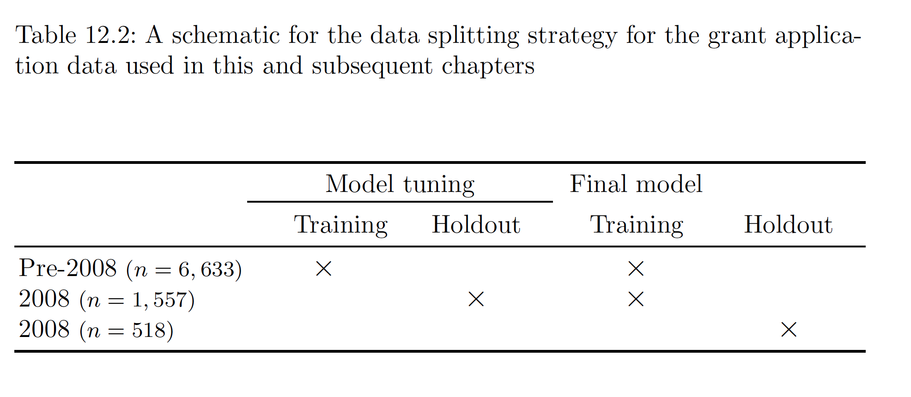

***
title: "Predictive Modeling Approach"
author: "Sophia Gao"
date: "February 7, 2015"
output: html_document
***

## What is the goal?
* test 
## Understand and Process Data

### Feature Engineering
* encode data
    + get model-ready summarized variables like how many people in the household 
    + indicator variables
        
### Handle Missing Values

* For categorical variables
    + encode as “unknown"
        
### Multicollinearity

### Near-Zero Variance Predictors

### Time-trend detection

* Does the target vary over the years?
* If the grant success rate were relatively constant over the years, a reasonable data splitting strategy would be relatively straightforward.
    
### Train and Test

* Random Sample
    + If the target were relatively constant over the years, a reasonable data splitting strategy would be relatively straightforward: take all the available data, reserve some data for a test set(usually take the last year's data), and use resampling with the remainder of the samples for tuning the various models. 
        
* Evolve over time
    + An alternative strategy would be to create models using the data before this year, but tune them based on how well they fit this year's data. However, this strategy may lead to substantial over*fitting to this particular year and may not generalize well to subsequent years. 
    + There is no single, clean approach to handling this issue for data that appear to be evolving over time. Therefore the parctitioner must understand the modeling objectives and carefully craft a plan for training and testing models.
    + Do we have a moderate amount of recent data?

### Tuning Parameters
* Cross Validation

    
